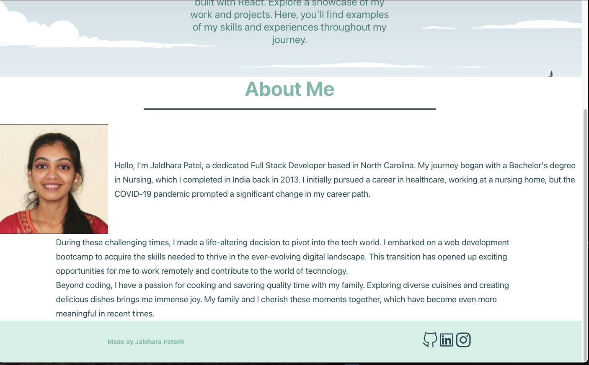
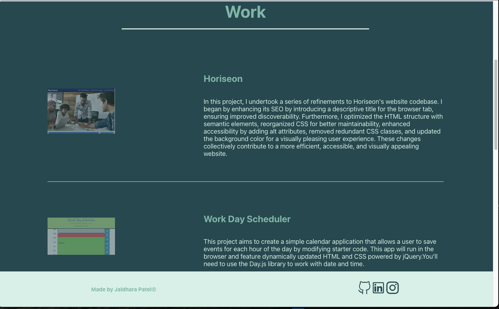
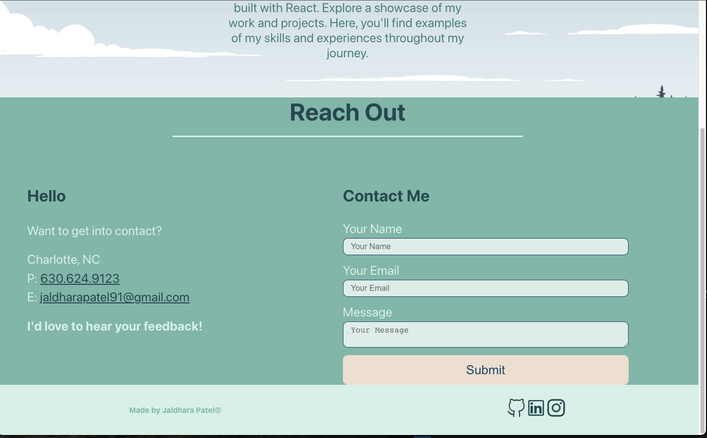
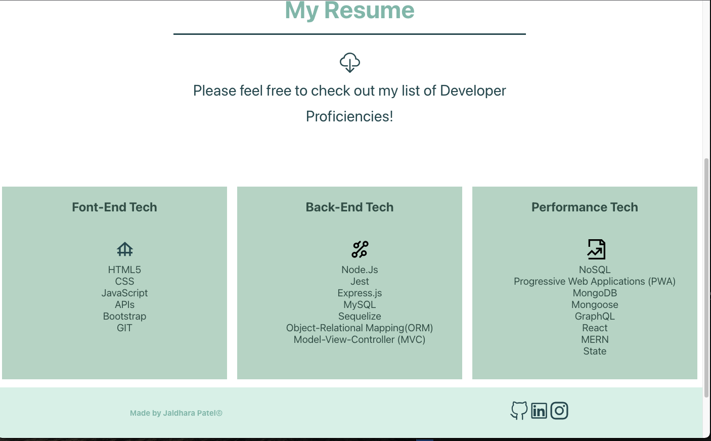

# **React Portfolio**

  [](https://opensource.org/licenses/MIT)

  ## **Description**
  This **React Portfolio** is a single-page application that showcases your experience, projects, and resume. The portfolio allows a developer to share experience, projects, and resume while applying for jobs or working as a freelancer, and also to share work with other developers and collaborate on projects. The portfolio includes a contact form for users to reach out via email and is deployed on GitHub Pages.

  ## Table of Contents:
- [Overview](#Overview)
- [The Challenge](#The-Challenge)
- [Usage Information](#Usage-Information)
- [Installation Process](#Installation-Process)
- [Built With](#Built-With)
- [What I Learned](#What-I-Learned)
- [License](#License)
- [question](#question)

# Overview
This React Portfolio serves as a dynamic and interactive platform for developers to present their skills and projects. It not only offers a visually appealing design but also provides a smooth navigation experience for visitors. With its intuitive layout, it effectively addresses the needs of both job seekers and freelancers, making it a valuable tool for anyone in the tech industry.

  This portfolio satisfies the following requirements:
  
  User Story 
```md
AS AN employer looking for candidates with experience building single-page applications
I WANT to view a potential employee's deployed React portfolio of work samples
SO THAT I can assess whether they're a good candidate for an open position
```
Acceptance Criteria
```md
GIVEN a single-page application portfolio for a web developer
WHEN I load the portfolio
THEN I am presented with a page containing a header, a section for content, and a footer
WHEN I view the header
THEN I am presented with the developer's name and navigation with titles corresponding to different sections of the portfolio
WHEN I view the navigation titles
THEN I am presented with the titles About Me, Portfolio, Contact, and Resume, and the title corresponding to the current section is highlighted
WHEN I click on a navigation title
THEN I am presented with the corresponding section below the navigation without the page reloading and that title is highlighted
WHEN I load the portfolio the first time
THEN the Home title and Hero section are selected by default
WHEN I am presented with the Hero section
THEN I see a recent photo and eye-catching tagline and animation
WHEN I am presented with the About Me section
THEN I see the name of the developer and a short bio about them, and their experience and skills. 
WHEN I am presented with the Portfolio section
THEN I see titled images of six of the developer’s applications with links to both the deployed applications and the corresponding GitHub repositories
WHEN I am presented with the Contact section
THEN I see a contact form with fields for a name, an email address, and a message
WHEN I move my cursor out of one of the form fields without entering text
THEN I receive a notification that this field is required
WHEN I enter text into the email address field
THEN I receive a notification if I have entered an invalid email address
WHEN I am presented with the Resume section
THEN I see a link to a downloadable resume and a list of the developer’s proficiencies
WHEN I view the footer
THEN I am presented with text or icon links to the developer’s GitHub and LinkedIn profiles, and their profile on a third platform (Stack Overflow, Twitter)
```

## **Screenshot of app**
 About page<br>

<br>
 Portfolio page<br>

<br> 
Contact page<br>

<br>
Resume page<br>

<br>

## Usage Instructions: 

1. **Navigation:** Easily navigate through sections like "About Me," "Portfolio," "Contact," and "Resume" by clicking on the navigation links.

2. **Showcase Work:** Display your projects with titled images, linking to both deployments and GitHub repositories, in the "Portfolio" section.

3. **Contact:** Receive messages from visitors using the contact form, featuring form validation and email notifications.

4. **Customize & Connect:** Easily customize content, including your bio and projects. Connect with visitors via GitHub, LinkedIn, and other platforms in the footer.


## Deployed Application Link:
[Deployed Application Link:]()

## GitHub Repository:
[GitHub Repository:](https://github.com/jaldhara21/React-Portfolio/tree/main/react-portfolio)

## **Installation Process**

  To run this application locally, follow these steps:

1. Clone the repository to your local machine.
   ```shell
   git clone https://github.com/jaldhara21/react-portfolio.git

## **Build With**
  This single-page application is built using the following technologies:
- React
- JavaScript
- CSS (or specify any CSS frameworks or libraries used)
- Other technologies...  

## What I Learned:
In developing this React Portfolio, I gained valuable experience in:

- Building a responsive single-page application using React.
- Designing an intuitive user interface for easy navigation and interaction.
- Implementing form validation and email notifications for the contact section.
- Showcasing projects with images and links to deployments and GitHub repositories.
- Customizing and managing content through React components and data files.
- Deploying a React application to GitHub Pages.

This project has not only enhanced my technical skills but also improved my ability to present my work effectively.

## License & Copyright ©
  
[](https://opensource.org/licenses/MIT) [Open Source Initiative Link](https://opensource.org/licenses/MIT)

## Questions

For additional questions, you can reach me through:

- GitHub: [jaldhara21](https://github.com/jaldhara21)
- Email: jaldharapatel91@gmail.com
